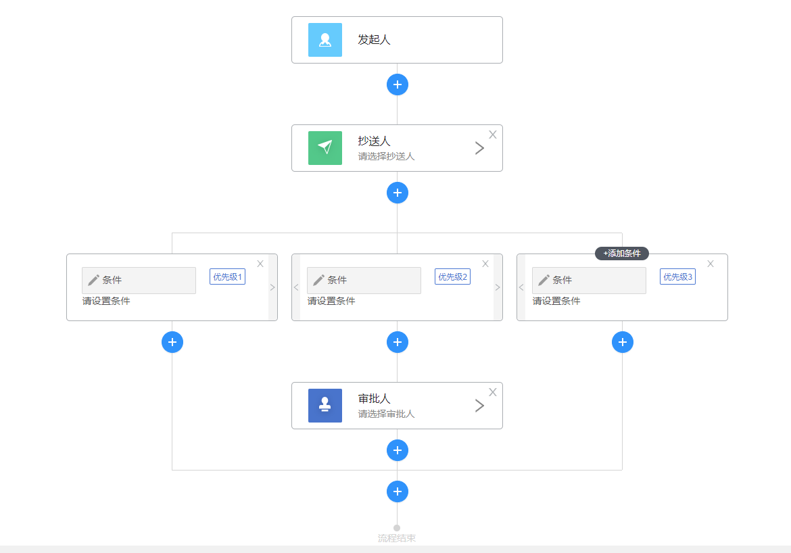

# demo

> 记录自己踩的坑：<br>
flex与overflow：scroll一起用导致问题；<br>
不能仅仅以组件开发的方式思考，还要站在宏观的角度思考；（树本身也是节点）<br>
先画图，先思考，再动手；<br>

## Build Setup

``` bash
# install dependencies
npm install

# serve with hot reload at localhost:8080
npm run dev

# build for production with minification
npm run build

# build for production and view the bundle analyzer report
npm run build --report
```

